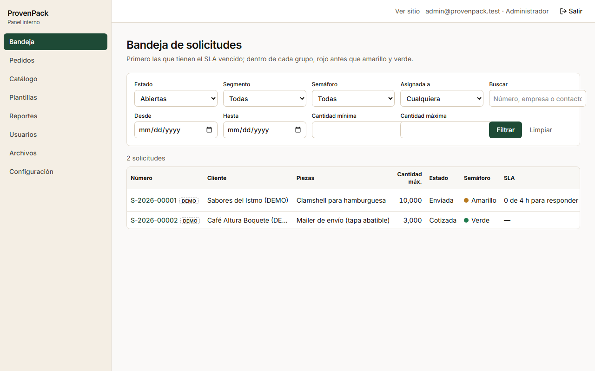
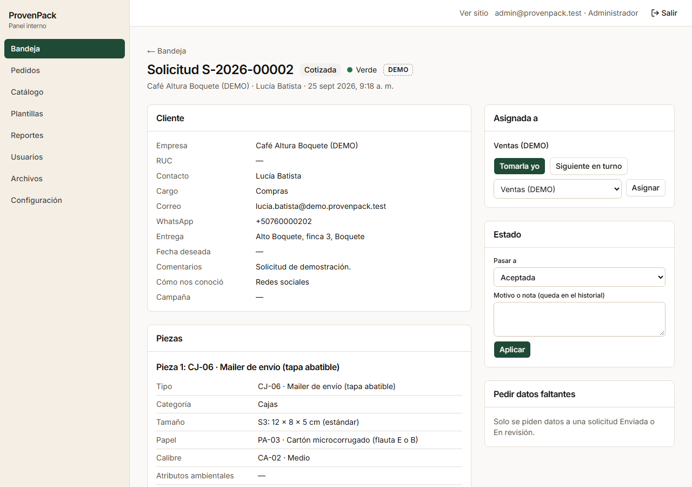
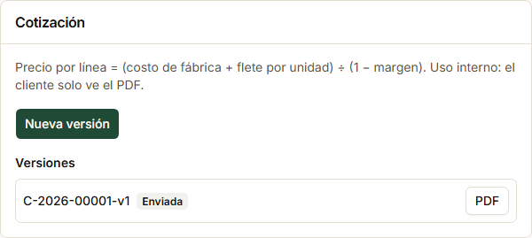
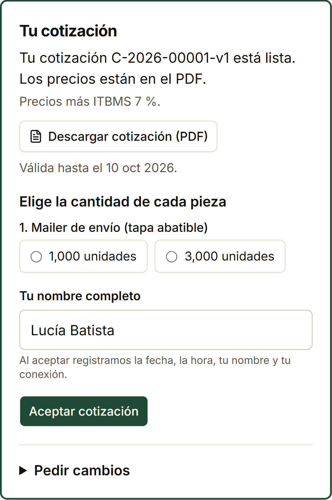
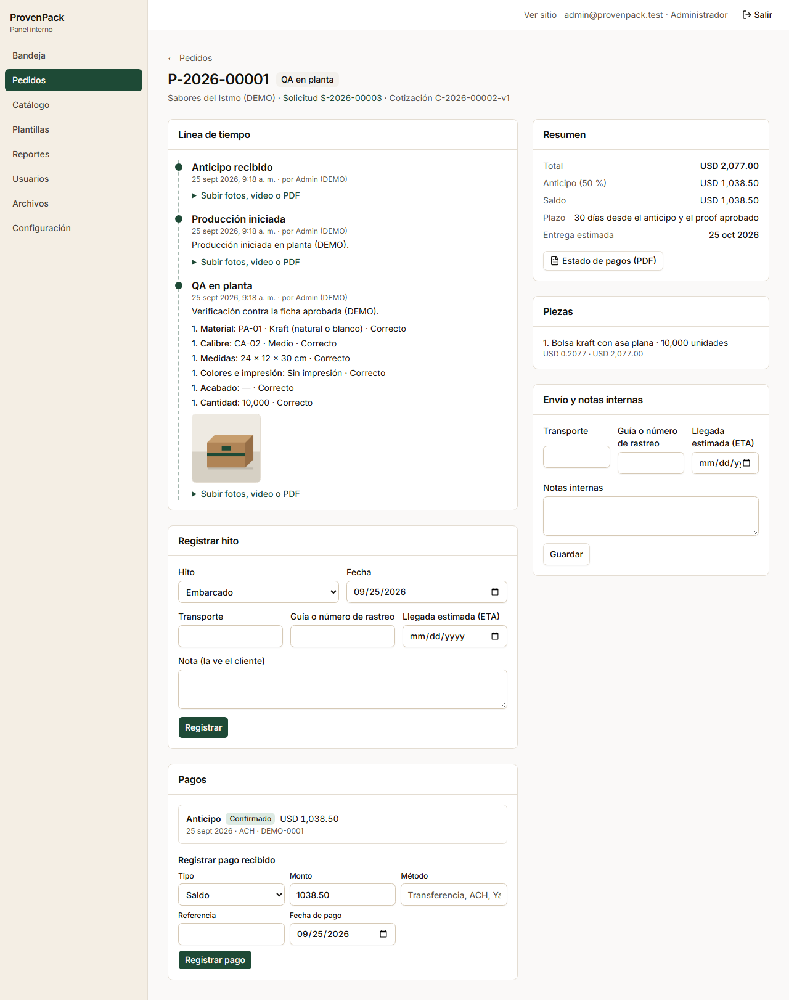
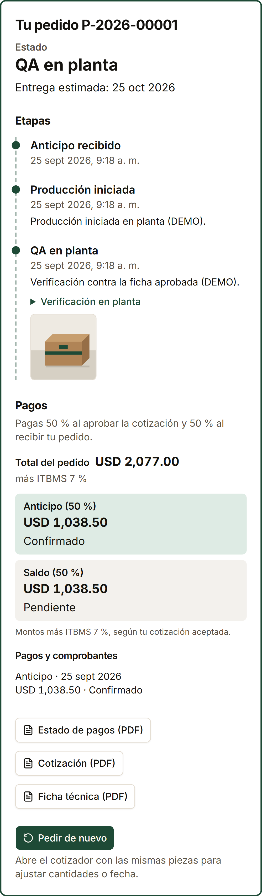

# Demo de 8 minutos · ProvenPack

Guion para mostrar la plataforma de punta a punta con datos de demostración: dos empresas marcadas **DEMO** y tres solicitudes, una en cada etapa. Todos los datos, costos y montos son ficticios.

## Antes de empezar (una vez)

```bash
pnpm install
pnpm db:reset          # base local limpia (borra solo la base local de .data/postgres)
pnpm db:seed-demo      # carga la demo e imprime los enlaces
pnpm dev               # http://localhost:3000
```

`pnpm db:seed-demo` imprime los enlaces de cada solicitud (panel y cliente). Guárdalos: los del cliente llevan un token distinto en cada carga. Si ya estaba cargada, vuelve a imprimirlos sin duplicar nada.

Opcional, en `.env.local`: `FACTORY_EMAIL=fabrica@demo.provenpack.test`, para que el panel no muestre el aviso de "Falta FACTORY_EMAIL" en la sección RFQ. La demo nunca envía correos reales: quedan como "simulados" en consola y en `.data/mail`.

| Qué | Dónde |
| --- | --- |
| Sitio público | `http://localhost:3000/` |
| Cotizador | `http://localhost:3000/cotizar` |
| Panel | `http://localhost:3000/admin` |
| Usuario admin | `admin@provenpack.test`, o el `ADMIN_EMAIL` de `.env.local`. En local, al pedir el enlace aparece en pantalla "Abrir enlace de acceso". |
| Usuario de ventas | `ventas.demo@provenpack.test` (asignado a las solicitudes DEMO) |
| Solicitud nueva | `S-…-00001` · Sabores del Istmo (DEMO) · clamshell para hamburguesa, sin arte (amarillo) |
| Solicitud cotizada | `S-…-00002` · Café Altura Boquete (DEMO) · mailer impreso con logo, RFQ respondido y cotización emitida |
| Pedido en QA | `S-…-00003` · Sabores del Istmo (DEMO) · bolsa kraft, anticipo confirmado, producción y QA con una foto |

Ten abiertas dos ventanas:

- el **panel** en escritorio, ya con la sesión iniciada;
- el **enlace del cliente** en un celular. Si no hay celular, usa el modo dispositivo del navegador (F12, luego Ctrl+Shift+M).

## Guion

### 0:00 – 1:00 · El sitio que ve el cliente

**Pantalla:** `/` y luego una ficha del catálogo, por ejemplo `/catalogo/cajas/plegadiza-con-tapa`.

- La promesa y el camino corto: dos puertas (Comercio y Alimentos) y el botón **Cotizar**.
- Ningún precio en la web: el precio sale solo de una cotización del equipo.
- Cada ficha lleva a **Cotizar esta pieza** con el tipo ya elegido.

### 1:00 – 2:30 · El cotizador en el celular

**Pantalla:** `/cotizar?tipo=CJ-06` en el celular.

1. Elegir **Comercio** y avanzar por producto, tamaño, material, impresión y cantidades.
2. Señalar lo que evita errores:
   - las combinaciones que no se fabrican aparecen bloqueadas, con el motivo;
   - el borrador se guarda solo;
   - **Guardar y seguir después** manda el enlace por correo o WhatsApp.
3. En el resumen, no hace falta enviar: la solicitud ya enviada está en el panel. Si se envía, entra a la bandeja como una más.

### 2:30 – 3:30 · La bandeja del equipo

**Pantalla:** `/admin/solicitudes`



- **Orden por urgencia:** SLA vencido primero y, luego, rojo, amarillo y verde.
- **SLA** en horas hábiles: 4 h para la primera respuesta.
- **Etiqueta DEMO** en las solicitudes de la demostración.
- Abrir la **nueva** (`S-…-00001`):
  - amarilla, porque el cliente todavía no tiene arte;
  - **Tomarla yo**;
  - **Pedir datos faltantes** arma la lista desde el semáforo y la manda por correo y WhatsApp. Mostrarlo sin enviarlo.

### 3:30 – 4:45 · De la solicitud a la cotización, sin retipear

**Pantalla:** la solicitud **cotizada** (`S-…-00002`, Café Altura Boquete).



- **Arte y proofs:** el logo que subió el cliente, con el checklist de preprensa.
- **RFQ a fábrica:** PDF y Excel generados desde la ficha, con los códigos de catálogo, ya enviados. La respuesta de la fábrica está registrada.
- **Cotización:** la versión v1 emitida, con su **PDF**.
  - Abrirlo: precios por cantidad, vigencia, 50/50, plazo y la leyenda **"más ITBMS 7 %"**.
  - El margen y el flete se ven solo en el panel.



### 4:45 – 5:45 · El cliente acepta desde su enlace

**Pantalla:** el enlace del cliente de la **cotizada**, en el celular.



1. El cliente descarga el PDF, elige **3,000 unidades**, escribe su nombre y pulsa **Aceptar cotización**.
2. En el panel, al recargar: la solicitud queda **Aceptada** y aparece el botón **Pedido P-…**.
   - El pedido se creó solo, con el total, el anticipo y el saldo.
   - Queda registrado cuándo y quién aceptó, con su conexión.

### 5:45 – 7:00 · El pedido: QA con foto y montos claros

**Pantalla:** `/admin/pedidos` y luego el pedido de **Sabores del Istmo** (en QA).



- **Línea de tiempo:** anticipo recibido, producción iniciada y QA en planta.
  - El QA tiene el checklist contra la ficha aprobada (material, calibre, medidas, impresión, acabado, cantidad) y la foto.
  - Producción no se puede registrar sin anticipo, ni sin proof si la pieza lleva impresión.
- **En vivo:** **Registrar hito → Embarcado**, con una guía de rastreo (por ejemplo `DEMO-001`).
- **En el celular,** el enlace del cliente de este pedido muestra:
  - las etapas con la foto de QA;
  - el total, el anticipo (confirmado) y el saldo (pendiente), "más ITBMS 7 %";
  - la lista de pagos y los PDF. El botón para subir el comprobante del saldo aparece cuando el pedido se entrega.



### 7:00 – 8:00 · Reportes y lo que falta para lanzar

**Pantalla:** `/admin/reportes`

- Conversión por segmento, tiempos por etapa, motivos de pérdida, pedidos por vencer y canal. Cada tabla se descarga en CSV.
- **Cierre:** lo que falta para salir en vivo está en `docs/lanzamiento.md`: catálogo y fotos reales, cuentas, datos de pago y textos legales con la razón social.

## Qué mostrar en cada pantalla

| Pantalla | Ruta | Qué señalar |
| --- | --- | --- |
| Inicio | `/` | Sin precios; dos segmentos; botón de cotizar siempre visible |
| Ficha | `/catalogo/<categoría>/<tipo>` | Usos, medidas y "Cotizar esta pieza" |
| Cotizador | `/cotizar` | Pasos cortos, bloqueos con motivo, guardado automático, resumen |
| Bandeja | `/admin/solicitudes` | Urgencia, SLA hábil, semáforo, DEMO, asignación |
| Solicitud | `/admin/solicitudes/<id>` | Ficha por pieza, arte con checklist, RFQ, cotización, historial, notificaciones con WhatsApp |
| Pedido | `/admin/pedidos/<id>` | Hitos válidos, QA con fotos, pagos y comprobantes, entrega estimada, estado de pagos (PDF) |
| Cliente | `/seguimiento/<token>` | Estado, cotización para aceptar, etapas con fotos, montos con ITBMS, comprobante, "Pedir de nuevo" |
| Reportes | `/admin/reportes` | Tablas por período y CSV |

## Volver a empezar

```bash
pnpm db:reset && pnpm db:seed-demo
```

Deja la base local como nueva, con la demo cargada. **No usar contra producción:** `db:reset` se niega a correr contra Supabase, y `db:seed-demo` también, salvo con `--permitir-supabase` para una base de prueba.
