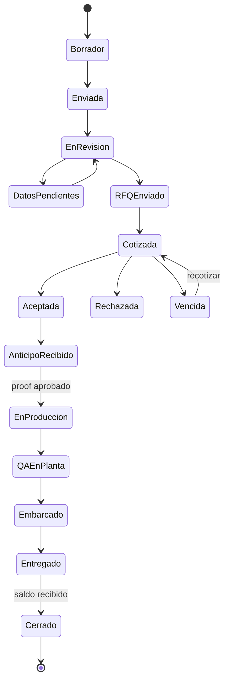
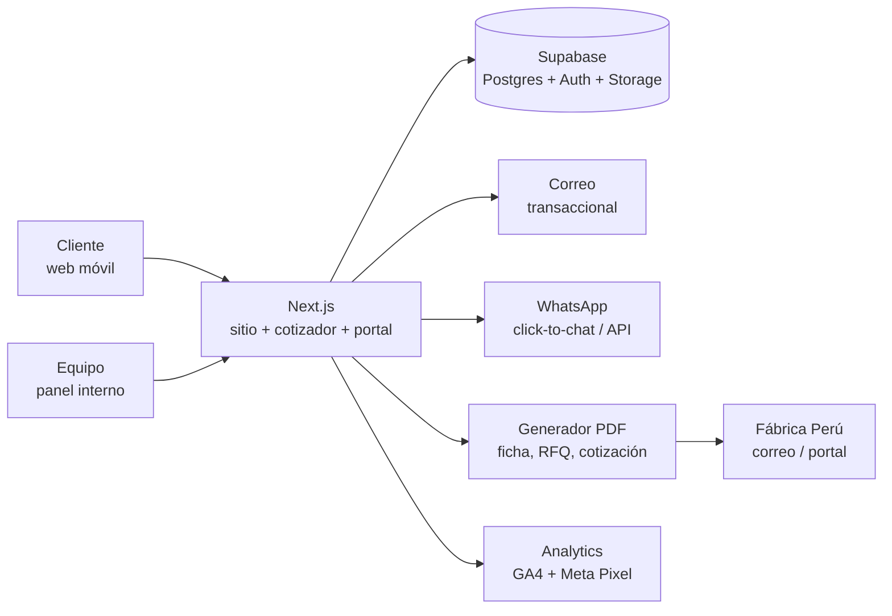

# PRD — Plataforma web y cotizador de empaques

24 de septiembre de 2026 · Mark Marcel Harrick Atie · Versión 0.1 (copia para el repositorio; el original vive en Claude Docs)

## 1. Resumen ejecutivo y visión

Construir una plataforma web con catálogo y cotizador guiado que capture, en menos de 5 minutos, toda la información que la fábrica en Perú necesita para costear una pieza, para que el equipo responda con una cotización formal en 24 horas hábiles (meta propuesta) y gane por precio, calidad y atención.

**Qué es.** Un sitio público con catálogo de cajas y bolsas, un configurador de especificaciones paso a paso, carga de arte y referencias, un portal ligero para el cliente y un panel interno para validar solicitudes, pedir costos a fábrica, emitir cotizaciones y seguir cada pedido hasta la entrega y el cobro del saldo.

**Qué no es.** No es una tienda con precio en línea: el precio se define caso por caso porque depende de material, impresión, cantidad y flete. El cotizador adelanta todo lo demás — especificación completa, tiempo de entrega, condiciones de pago y siguiente paso — para que el precio llegue rápido y bien afinado.

**Por qué gana.** Cada solicitud entra completa y estructurada, el equipo deja de perseguir datos y arte por WhatsApp, y la fábrica recibe una ficha técnica lista para costear. El cliente ve desde el primer minuto lo que nadie más le ofrece junto: sin límite de volumen, 50 % de anticipo y 50 % contra entrega, verificación en planta por el propio equipo y materiales amigables con el ambiente.

| Ficha | Detalle |
| --- | --- |
| Producto | Plataforma web + cotizador de empaques (nombre comercial: ProvenPack, elegido por Mark el 24/09/2026; dominio por registrar) |
| Mercado inicial | Panamá (asumido por la sede de la empresa; expansión regional por definir) |
| Segmentos | Comercial (almacenes, retail, e-commerce) y alimentario (restaurantes, food service, delivery) |
| Modelo | Comercializadora con fábrica en Perú; la fábrica produce con el anticipo del cliente y cobra el saldo contra entrega |
| Condiciones | 50 % anticipo / 50 % contra entrega; entrega en 45 días (30 días en volúmenes menores, umbral por definir) |
| Diferenciador | "Probamos que somos los mejores": verificación en planta, sin límite de volumen, materiales amigables con el ambiente |
| Idiomas | Español (MVP); inglés (fase 2) |
| Dueño del producto | Mark Marcel Harrick Atie |
| Versión del PRD | 0.1, borrador para revisión |

## 2. Contexto del negocio y problema a resolver

La empresa vende empaques de cualquier tipo (cajas, bolsas, bolsas premium, empaque alimentario) fabricados en una planta propia en Perú con maquinaria industrial de gran escala, por lo que no hay límite de tamaño de orden. La fábrica financia la producción: despacha con el anticipo del cliente y el saldo se paga contra entrega.

**El problema.** Cotizar bien exige reunir de una sola vez unos diez datos técnicos (tipo, tamaño, papel, calibre, colores, cantidad, producto, contenido, peso, volumen), más referencias y el arte digital que procesa la máquina. Sin una captura estructurada, cada cotización se convierte en idas y vueltas por chat, el tiempo de respuesta crece y la fábrica recibe fichas incompletas. La plataforma existe para que la información entre completa a la primera y la oferta salga en horas, no en días.

| Ventaja competitiva | Qué significa para el cliente | Cómo lo demuestra la plataforma |
| --- | --- | --- |
| Fábrica propia en Perú, maquinaria de gran escala | Puede pedir 500 o 500.000 unidades; sin mínimos ni máximos | Ningún campo de cantidad bloquea; galería de producción y video de planta |
| Financiamiento de la producción | Solo desembolsa 50 % al aprobar y 50 % al recibir | Condiciones visibles en el cotizador y en cada cotización PDF |
| Verificación en planta por el propio equipo | Recibe el producto tal cual se pactó | Hito "QA en planta" con fotos y video en el seguimiento del pedido |
| Materiales amigables con el ambiente | Empaque alineado con su marca y con exigencias de cadenas | Atributos ambientales seleccionables; certificaciones publicadas solo con respaldo documental |
| Experiencia con marcas líderes (KFC, McDonald's y otras) | Confianza en procesos exigentes de cadenas | Sección de clientes y casos (uso de logos sujeto a autorización de cada marca) |
| Tiempos claros: 45 días, o 30 en volúmenes menores | Puede planificar lanzamientos y temporadas | Estimador de fecha de entrega en el cotizador según cantidad y fecha de aprobación |
| Atención directa | Habla con quien viaja a la planta | WhatsApp integrado con el número de solicitud en cada mensaje |

**Activos disponibles para construir.** Fotos de muestras, una maleta con más de 200 muestras físicas, referencias de clientes y acceso directo a la fábrica para fichas técnicas y costos.

## 3. Objetivos y métricas de éxito (KPIs)

El producto tiene éxito si acorta el ciclo solicitud → cotización → pedido y eleva la calidad de la información que llega a fábrica. Las metas son propuestas iniciales; se calibran con los primeros 60 días de datos reales.

| Objetivo | Métrica | Meta MVP (propuesta) | Cómo se mide |
| --- | --- | --- | --- |
| Cotizar más rápido | Horas hábiles desde solicitud completa hasta cotización enviada | ≤ 24 h (mediana) | Timestamps de estados en el panel interno |
| Información completa a la primera | % de solicitudes sin campos críticos faltantes al enviarse | ≥ 85 % | Semáforo de completitud al recibir la solicitud |
| Arte utilizable | % de archivos de arte aprobados sin reproceso | ≥ 70 % | Estado del checklist de preprensa por versión |
| Conversión web | Visitas únicas → solicitud enviada | ≥ 3 % | Analytics de embudo por paso |
| Abandono del cotizador | % que inicia y no envía | ≤ 40 % | Eventos por paso del wizard |
| Esfuerzo del cliente | Minutos para completar el cotizador | ≤ 5 min (mediana) | Tiempo entre primer paso y envío |
| Cierre | Cotizaciones aceptadas / cotizaciones enviadas | ≥ 25 % | Estados Aceptada vs Enviada |
| Cero retipeo | % de RFQ a fábrica generados desde la plataforma | 100 % | Documentos RFQ emitidos por el sistema |
| Cumplimiento de entrega | % de pedidos entregados dentro del plazo pactado | ≥ 90 % | Fecha pactada vs hito Entregado |
| Satisfacción | NPS post-entrega | ≥ 60 | Encuesta automática al cerrar el pedido |
| Recompra | % de clientes con segunda orden en 6 meses | ≥ 30 % | Pedidos por cuenta |

**Métricas de salud (sin meta, para vigilar):** solicitudes por segmento y tipo de empaque, motivos de pérdida de cotizaciones, tiempo de respuesta de la fábrica al RFQ, incidencias de calidad detectadas en QA, tráfico por canal (orgánico, Meta Ads, WhatsApp, referidos).

## 4. Usuarios y perfiles (personas)

Ocho perfiles usan la plataforma; los tres primeros son clientes y deciden el diseño del cotizador, los demás son el equipo y la fábrica y deciden el diseño del panel interno.

| Perfil | Quién es | Qué necesita | Frustración típica | Qué le da la plataforma |
| --- | --- | --- | --- | --- |
| Cliente comercial | Gerente de compras o marketing de almacén, tienda, e-commerce | Bolsas de compra y cajas de envío o producto con su marca, a buen precio | No sabe de calibres ni papeles; le piden datos que no tiene | Wizard con fotos, opción "no sé, asesórenme", muestras reales como referencia |
| Cliente alimentario | Dueño u operaciones de restaurante, cadena, dark kitchen, panadería, cafetería | Empaque apto para alimentos, grasa y calor; reposición recurrente | Le fallan tiempos y calidad; el empaque se humedece o se rompe | Atributos de contacto alimentario, pedidos recurrentes, fecha de entrega estimada |
| Gran cuenta / cadena | Compras corporativas de cadenas (tipo KFC o McDonald's) | Especificación estricta, muestras, trazabilidad, documentación | Proveedores informales sin evidencia de control de calidad | Ficha técnica formal, proof aprobado, evidencias de QA en planta, historial por cuenta |
| Diseñador o agencia del cliente | Quien prepara el arte | Plantilla de troquel, medidas, sangrado, perfil de color | Rehacer el arte por falta de especificaciones | Checklist de preprensa, plantillas descargables (fase 2), comentarios por versión |
| Vendedor / cotizador interno | Equipo comercial de la empresa | Solicitudes completas, costo de fábrica rápido, cotización con marca | Perseguir datos y arte; retipear en Excel | Bandeja con semáforo, RFQ generado, plantillas de mensajes, cotización PDF en un clic |
| Coordinador de producción y QA | Quien viaja a Perú y sigue la orden | Especificación aprobada, checklist de calidad, canal para subir evidencias | Reclamos sin evidencia; pactado vs. entregado sin registro | Hitos con fotos y video, checklist vs. especificación, alertas de retraso |
| Gerencia | Mark y socios | Pipeline, tiempos, conversión, márgenes | Ver el negocio solo por chats y hojas sueltas | Tablero de reportes y exportación a hoja de cálculo |
| Fábrica en Perú (fase 2) | Planificación y costos de la planta | RFQ estructurado en su formato, canal para responder costo y tiempo | Fichas incompletas por correo | Portal o correo estructurado con la ficha técnica y el arte aprobado |

## 5. Alcance por fases y fuera de alcance

El MVP entrega el ciclo completo solicitud → cotización → pedido sin precio en línea ni pagos en línea; la fase 2 automatiza arte, precios internos y portal; la fase 3 escala a recurrencia y nuevos países.

| Módulo | MVP (fase 1) | Fase 2 | Fase 3 |
| --- | --- | --- | --- |
| Web pública | Inicio, catálogo, fichas, galería de muestras, proceso, sostenibilidad, clientes, FAQ, contacto, SEO base | Versión en inglés, blog y casos de éxito, landings por segmento y campaña | Multi-país con precios y tiempos por destino |
| Cotizador | Wizard completo con especificación, producto, cantidades, arte, referencias, contacto y resumen; guardado de progreso | Plantillas de troquel por tipo y tamaño, comparador de opciones | Cotización interna acelerada para piezas repetidas (el precio siempre lo emite el equipo) |
| Arte | Carga de archivos, checklist manual de preprensa, versiones, proof digital | Preflight automático (formato, medidas, CMYK, resolución, fuentes) | Editor en línea de arte sobre plantilla |
| Portal del cliente | Enlace seguro para ver estado de solicitud, cotización y pedido | Cuenta completa: historial, documentos, aprobaciones, recompra en un clic, varios usuarios por empresa | Pedidos recurrentes programados, consignación e inventario |
| Panel interno | Bandeja, semáforo de completitud, asignación, notas, RFQ a fábrica (PDF/Excel), cotización PDF, pedidos con hitos y evidencias de QA, registro de pagos | Motor de precios (matriz de costos de fábrica + margen), reportes avanzados, portal de fábrica | Integración contable y de facturación electrónica |
| Comunicación | Correo transaccional y WhatsApp click-to-chat con número de solicitud | WhatsApp Business API bidireccional con plantillas aprobadas, recordatorios automáticos | Chatbot de precalificación |
| Pagos | Registro manual de anticipo y saldo con comprobante | Pago en línea del anticipo (transferencia/ACH, Yappy o tarjeta: por definir) | Financiamiento y crédito a cuentas recurrentes |

**Fuera de alcance (todas las fases, salvo decisión expresa):** precio final calculado sin revisión humana; diseño gráfico del arte como parte del cotizador (si se ofrece como servicio, se cotiza aparte: por definir); tienda con carrito y pago total en línea; producción o envío de muestras físicas gestionado en línea (política por definir).

## 6. Recorrido del cliente end-to-end

El cliente pasa por 14 etapas, del descubrimiento a la recompra; la plataforma muestra en cada una qué sigue, quién actúa y cuándo, y el equipo interno tiene un SLA por etapa.

```mermaid
flowchart LR
  A[Descubre<br/>web, Meta Ads, WhatsApp] --> B[Explora catálogo<br/>y muestras]
  B --> C[Configura pieza<br/>en el cotizador]
  C --> D[Sube arte y<br/>referencias]
  D --> E[Envía solicitud<br/>recibe número]
  E --> F[Equipo valida<br/>y pide costo a fábrica]
  F --> G[Cotización formal<br/>PDF + WhatsApp]
  G --> H[Aprueba proof<br/>y paga 50 %]
  H --> I[Producción<br/>en Perú]
  I --> J[QA en planta<br/>fotos y video]
  J --> K[Embarque<br/>y tránsito]
  K --> L[Entrega<br/>y saldo 50 %]
  L --> M[Encuesta y<br/>recompra]
```

De A a E el cliente actúa solo con la web; de F a G actúa el equipo; de H en adelante ambos ven el mismo seguimiento.

| Etapa | Qué hace el cliente | Qué hace el equipo | Qué muestra la plataforma | SLA propuesto |
| --- | --- | --- | --- | --- |
| Descubrir y explorar | Llega desde anuncio, búsqueda o referido; mira catálogo y muestras | Nada (contenido preparado) | Fichas con fotos reales, "cotizar esta pieza" | n/a |
| Configurar y enviar | Completa el wizard, sube arte o marca "no tengo arte" | Nada | Resumen tipo ficha técnica, condiciones, número de solicitud | ≤ 5 min de esfuerzo |
| Validar | Responde datos faltantes si se le piden | Revisa completitud y arte, pide lo que falte, arma RFQ | Estado "En revisión" o "Datos pendientes" con lista clara | 4 h hábiles para primera respuesta |
| Cotizar | Recibe cotización por correo y WhatsApp | Registra costo de fábrica, aplica margen, emite PDF | Cotización con vigencia, tiempos y condiciones; botón Aceptar | ≤ 24 h hábiles desde solicitud completa |
| Aprobar y anticipar | Aprueba proof digital, paga 50 % | Confirma pago, libera orden a fábrica | Pedido creado, fecha estimada de entrega | Confirmación de pago en 1 día hábil |
| Producir y verificar | Sigue hitos | Coordina fábrica, viaja y sube evidencias de QA | Hitos con fotos y video, checklist vs. especificación | Actualización semanal mínima |
| Embarcar y entregar | Recibe, revisa, paga saldo | Gestiona embarque, aduana y entrega | Tracking, ETA, acta de entrega, recordatorio de saldo | 45 días (30 en volúmenes menores) |
| Recompra | Repite pedido con un clic | Contacta con oferta de reposición | Historial, "pedir de nuevo", encuesta NPS | Encuesta a 7 días de la entrega |

## 7. Catálogo y taxonomía de productos

El catálogo es un conjunto de datos maestros administrables (no texto fijo en la web): cada opción tiene código, nombre, foto, descripción, disponibilidad, reglas de compatibilidad y notas para fábrica. Las cantidades por dimensión las fijó Mark (3 calibres, 5 papeles, 12 tipos de caja, 10 tamaños, más de 10 colores); los valores concretos de la tabla son una propuesta basada en estándares de la industria y deben validarse contra la maleta de 200 muestras y la ficha técnica de la fábrica antes de cargarse.

| Dimensión | Cantidad definida | Valores propuestos (a validar) | Afecta precio | Notas |
| --- | --- | --- | --- | --- |
| Categorías | 4 | Cajas; Bolsas; Bolsas premium (boutique); Empaque alimentario (food service) | Sí | Complementos (insertos, separadores, etiquetas) como categoría opcional |
| Tipos de caja | 12 | Candidatos: plegadiza con tapa (tuck end); tapa reversa (reverse tuck); autoarmable de fondo automático; bandeja; dos piezas base y tapa; caja rígida; mailer de envío (tapa abatible); RSC de corrugado; gable con asa; clamshell para hamburguesa; cono/scoop para papas; balde para pollo; caja para pizza; caja para sándwich o wrap; caja con ventana; caja para torta/pastelería; sleeve o faja. Elegir los 12 reales | Sí | Cada tipo lleva foto de muestra propia, usos típicos y familias de tamaño |
| Tipos de bolsa | POR DEFINIR | Kraft con asa plana; kraft con asa retorcida; boutique laminada con asa de cordón; SOS de fondo cuadrado sin asa (panadería); bolsa para delivery; bolsa antigrasa; sobre con ventana | Sí | Mark mencionó bolsas y bolsas más finas; confirmar lista |
| Papeles | 5 | Kraft (natural o blanco); cartulina plegadiza (SBS o dúplex); cartón corrugado (microcorrugado E/B); papel estucado (couché) para premium; papel antigrasa o con barrera para alimentos | Sí | Confirmar nombres comerciales exactos con fábrica |
| Calibres | 3 | Ligero, medio y pesado, expresados en g/m² o puntos según la fábrica (valores POR DEFINIR) | Sí | La web muestra un nombre simple y, al pasar el cursor, el dato técnico |
| Tamaños | 10 | 10 tamaños estándar por familia de tipo (POR DEFINIR con muestras), más tamaño personalizado en cm (largo × ancho × alto, interior) | Sí | Personalizado siempre permitido; se advierte que puede cambiar tiempo y precio |
| Colores de impresión | 10+, todos | Sin impresión; 1 tinta; 2 tintas; 4 tintas (CMYK, full color); Pantone especial (código libre); más de 4 tintas | Sí | Caras: exterior, interior o ambas; cobertura: logo, parcial o total |
| Acabados | POR DEFINIR | Laminado mate; laminado brillo; barniz UV parcial o total; hot stamping (foil); relieve o bajorrelieve; ventana con película; troquel especial | Sí | Mark no los mencionó; confirmar cuáles ofrece la fábrica |
| Atributos ambientales | POR DEFINIR | Papel reciclado; fibra certificada (por ejemplo FSC); compostable; sin recubrimiento plástico | Puede | Publicar solo con certificado vigente de la fábrica |
| Aptitud alimentaria | POR DEFINIR | Contacto directo con alimentos; resistente a grasa; apto para calor; apto para frío o congelado; apto para microondas | Puede | Obligatorio elegir al menos uno en el segmento alimentario |

**Reglas de compatibilidad.** El administrador define qué papeles y calibres admite cada tipo (por ejemplo, un balde para pollo exige papel antigrasa; una caja rígida no se hace en microcorrugado). El cotizador solo ofrece combinaciones válidas y explica por qué una opción no aplica.

**Ficha de producto (página pública por tipo).** Nombre, categoría, 3 a 6 fotos de muestras reales, usos típicos por segmento, papeles y calibres compatibles, tamaños estándar, opciones de impresión y acabados, aptitud alimentaria, nota "sin cantidad mínima", tiempo de entrega y botón "Cotizar esta pieza" que abre el wizard precargado.

**Galería de muestras.** Fotos de la maleta de más de 200 muestras, etiquetadas por segmento, tipo, papel y acabado, con filtros y un botón "quiero algo así" que agrega la muestra como referencia a la solicitud. Cada muestra tiene un código visible (M-001, M-002…) para citarla por WhatsApp.

## 8. Módulo Cotizador / Configurador

El cotizador es un wizard de 9 pasos, móvil primero, que produce una ficha técnica completa por pieza sin pedir nunca conocimientos técnicos: cada paso muestra fotos, admite "no sé, asesórenme" y guarda el progreso.

**Principios de diseño**

- Una solicitud puede tener varias piezas (por ejemplo, caja + bolsa + servilletero); cada pieza repite los pasos 2 a 5 y el resto es común.
- Nunca se muestra precio en el MVP ni en ninguna fase, porque el precio se define caso por caso (decisión de Mark); sí se muestra en tiempo real el plazo estimado, las condiciones 50/50 y qué pasa después de enviar.
- Cada opción técnica tiene foto y una línea en lenguaje simple ("calibre pesado: para productos de más de 2 kg o envíos").
- Progreso guardado por enlace mágico (correo o WhatsApp) para retomar desde otro dispositivo.
- Botón "Prefiero hablar" en todos los pasos: abre WhatsApp con el resumen parcial y el número de borrador.
- Entrada precargada desde una ficha del catálogo o una muestra de la galería.

| Paso | Nombre | Campos | Reglas y lógica condicional |
| --- | --- | --- | --- |
| 0 | Segmento | Comercial / Alimentario / No estoy seguro | Ajusta ejemplos, fotos y atributos obligatorios de los pasos siguientes |
| 1 | Qué vas a empacar | Producto (texto), qué va adentro, peso aproximado por unidad (g o kg), dimensiones o volumen del contenido, condiciones (caliente, frío, grasa, frágil, líquido), uso (vitrina, envío, delivery, evento, regalo) | Peso y dimensiones opcionales pero se explica por qué ayudan; "grasa" o "caliente" activan papel antigrasa/barrera como sugerido |
| 2 | Tipo de empaque | Categoría → tipo (tarjetas con foto) o "no sé, sugiéranme" | Solo tipos compatibles con el segmento; "no sé" salta a paso 6 y marca la solicitud para asesoría |
| 3 | Tamaño | Estándar (lista con medidas y foto) / personalizado (largo × ancho × alto en cm, interior) / "según mi producto" | Personalizado exige los tres valores > 0; "según mi producto" usa las dimensiones del paso 1 y avisa que el equipo propondrá el tamaño |
| 4 | Material | Papel (5) + calibre (3) + atributos ambientales + aptitud alimentaria | Solo combinaciones compatibles con el tipo; en segmento alimentario la aptitud es obligatoria; calibre sugerido según peso del paso 1 |
| 5 | Impresión y acabados | Sin impresión / 1 / 2 / 4 tintas / Pantone (código) / más; caras (exterior, interior, ambas); cobertura (logo, parcial, total); acabados (multiselección) | Pantone pide el código; "sin impresión" salta la carga de arte en el paso 7 |
| 6 | Cantidad y fecha | Hasta 3 cantidades a cotizar (por ejemplo 5.000 / 10.000 / 20.000); frecuencia (única, mensual, trimestral, por temporada); fecha en que lo necesita | Sin mínimo ni máximo; muestra el plazo estimado (30 o 45 días según umbral) y advierte si la fecha deseada es anterior al plazo |
| 7 | Arte y referencias | Arte: archivo (AI, PDF, EPS, SVG; PNG/JPG solo como referencia), "aun no tengo arte" o "necesito que lo diseñen"; referencias: fotos, enlaces, muestras de la galería marcadas | Hasta 10 archivos de 100 MB (propuesta); el checklist de la sección 9 se muestra al lado; sin arte no bloquea el envío pero baja el semáforo |
| 8 | Datos de contacto y entrega | Empresa, RUC (opcional), nombre, cargo, WhatsApp, correo, ciudad y dirección de entrega, cómo nos conoció, comentarios | WhatsApp o correo obligatorio; consentimiento de datos; dirección necesaria para estimar flete |
| 9 | Resumen y envío | Ficha técnica de cada pieza, condiciones (50/50, plazo), botón Enviar | Genera número (por ejemplo S-2026-00123), envía confirmación por correo y WhatsApp, muestra "qué sigue" con el compromiso de respuesta |

**Validaciones clave.** Correo con formato válido; WhatsApp con código de país; cantidades enteras > 0; dimensiones en cm con un decimal; archivos por extensión y tamaño; Pantone con formato (número + C/U); fecha deseada no anterior a hoy. Los mensajes de error dicen qué corregir, no solo "inválido".

**Salida de una solicitud.** Un registro estructurado (JSON) por pieza con todas las selecciones y sus códigos, los archivos adjuntos, una ficha técnica en PDF con la marca de la empresa y el semáforo de completitud calculado: verde (lista para fábrica), amarillo (faltan datos no críticos como peso o referencias), rojo (falta cantidad, tipo o arte cuando hay impresión).

**Analytics del embudo.** Evento por paso iniciado y completado, opción elegida en cada campo, abandono con último paso, tiempo total, canal de origen (UTM) y clics en "Prefiero hablar".

## 9. Arte, plantillas de troquel y preprensa

Ningún arte viaja a fábrica sin pasar el checklist de preprensa y sin un proof aprobado por el cliente con fecha y hora; en el MVP la revisión es manual con checklist, en fase 2 se automatiza.

| Requisito de arte | Especificación (estándar de industria; confirmar con fábrica) |
| --- | --- |
| Formatos aceptados | PDF (idealmente PDF/X), AI, EPS, SVG; PNG y JPG solo como referencia visual |
| Modo de color | CMYK o Pantone (tintas planas); nunca RGB |
| Resolución de imágenes | Mínimo 300 dpi al tamaño final |
| Sangrado y área segura | 3 mm de sangrado; textos y logos a 3–5 mm del corte y de los pliegues |
| Tipografías | Convertidas a curvas o incrustadas |
| Troquel | En capa separada con tinta plana nombrada (por ejemplo "Dieline"), sin sobreimpresión |
| Líneas y textos mínimos | Texto ≥ 6 pt; líneas ≥ 0,25 pt; negro rico solo en fondos grandes |
| Tamaño de archivo | Hasta 100 MB por archivo (propuesta), 10 archivos por pieza |

**Flujo de revisión.** Recibido → En revisión → Observado (comentarios por punto del checklist, se pide nueva versión) → Aprobado para proof → Proof enviado → Proof aprobado por el cliente (clic con fecha, hora y usuario) → Liberado a fábrica. Cada versión conserva su archivo, su revisor y sus comentarios; el cliente ve el historial.

**Plantillas de troquel (fase 2).** Por cada tipo y tamaño estándar, un PDF y un AI descargables desde la ficha y desde el paso 7 del cotizador, con capas de corte, pliegue y área segura. Para tamaños personalizados el equipo genera la plantilla tras la cotización y la sube a la solicitud.

**Preflight automático (fase 2).** Al subir el archivo se verifica formato, tamaño de página contra el troquel, modo de color, resolución de imágenes, fuentes y presencia de sangrado; el resultado se muestra al cliente como lista de verificación con verde, amarillo y rojo, y se guarda con la versión.

**Cliente sin arte.** Si marca "no tengo arte" o "necesito diseño", la solicitud sigue su curso, el semáforo queda en amarillo y el equipo decide si ofrece diseño (servicio y tarifa por definir) o espera el arte antes de enviar el RFQ.

**Confidencialidad.** Los archivos se guardan en almacenamiento privado con enlaces firmados y caducidad; solo el cliente, el equipo asignado y, cuando se libera, la fábrica pueden verlos. Retención propuesta: 24 meses después del último pedido.

## 10. Portal del cliente

En el MVP el cliente sigue todo por un enlace seguro sin contraseña; en fase 2 tiene una cuenta por empresa con historial, aprobaciones y recompra en un clic.

| Función | MVP | Fase 2 |
| --- | --- | --- |
| Acceso | Enlace mágico por correo o WhatsApp, válido por solicitud | Cuenta por empresa con varios usuarios y roles (aprueba, consulta) |
| Solicitudes y cotizaciones | Ver estado, ficha técnica y cotización PDF; aceptar o pedir cambios | Comparar versiones de cotización; duplicar una solicitud con cambios |
| Arte | Subir nueva versión; ver comentarios del checklist; aprobar proof | Descargar plantillas de troquel; ver resultado de preflight |
| Pedidos | Línea de tiempo con hitos, fotos y video de QA en planta, tracking y ETA | Alertas configurables por canal; acta de entrega digital con firma |
| Documentos | Cotización, ficha técnica, comprobante de anticipo | Factura, guía de embarque, certificado de materiales, histórico descargable |
| Pagos | Ver montos y estado de anticipo y saldo; subir comprobante | Pagar en línea el anticipo (métodos por definir) |
| Recompra | Botón "pedir de nuevo" que abre el wizard precargado con la pieza | Pedidos programados y recordatorio de reposición según frecuencia declarada |
| Ayuda | WhatsApp con contexto de la solicitud | Chat interno con historial por pedido |

**Criterio de diseño.** Todo lo que el cliente ve en el portal es lo mismo que ve el equipo en el panel interno, con permisos distintos; no hay dos versiones de la verdad.

## 11. Panel interno de operaciones

El panel convierte cada solicitud en cotización y cada cotización aceptada en pedido sin salir de la plataforma: bandeja con semáforo, RFQ a fábrica en un clic, cotización PDF con marca, seguimiento de hitos con evidencias de QA y registro de pagos.

| Área | Funciones | Detalle |
| --- | --- | --- |
| Bandeja de solicitudes | Lista con filtros por estado, segmento, fecha, cantidad, asignado; semáforo de completitud; contadores de SLA | Orden por urgencia: rojo vencido de SLA primero; asignación manual o automática por turno |
| Detalle de solicitud | Ficha técnica por pieza, vista previa del arte, referencias, datos del cliente, historial, notas internas, registro de contactos | Botón "Pedir datos faltantes" con plantilla que lista exactamente lo que falta |
| RFQ a fábrica | Genera PDF y Excel con la ficha técnica en el formato de la fábrica, en español, con códigos de catálogo, cantidades y arte (si está liberado); envía por correo y registra fecha | Registro de la respuesta: costo unitario por cantidad, moneda, tiempo de producción, observaciones |
| Cotización formal | Precio por cantidad = costo de fábrica + flete estimado + margen (editable por línea); vigencia; condiciones 50/50; plazo; PDF con marca; envío por correo y WhatsApp; versiones | Aceptación con un clic desde el portal, o registro manual de aceptación por WhatsApp |
| Pedido y producción | Creación desde cotización aceptada; hitos: anticipo recibido, arte aprobado, en producción, QA en planta, embarcado, en aduana, entregado, saldo recibido, cerrado | Cada hito con fecha, responsable, evidencias (fotos, video, PDF) y checklist de QA contra la especificación |
| Pagos | Registro de anticipo y saldo con método, referencia y comprobante; recordatorios de saldo | Conciliación simple: cotizado, pagado, pendiente por pedido |
| Datos maestros | CRUD de categorías, tipos, tamaños, papeles, calibres, colores, acabados, atributos, compatibilidades, muestras de galería, textos y FAQ | Cambios versionados; una opción desactivada no rompe solicitudes antiguas |
| Plantillas | Mensajes de correo y WhatsApp por evento, editables con variables ({nombre}, {numero}, {plazo}) | Ver anexos de la sección 21 |
| Reportes | Pipeline por estado, tiempos por etapa, conversión, top tipos y materiales, motivos de pérdida, pedidos por vencer, tráfico por canal | Exportación a CSV y a hoja de cálculo para pegar en Google Sheets |
| Roles | Administrador, ventas, operaciones y QA, solo lectura; fase 2: usuario de fábrica con acceso solo a sus RFQ | Registro de auditoría de quién cambió qué y cuándo |

**Regla de oro.** Todo contacto con el cliente por WhatsApp o correo se registra en la solicitud (manual en MVP, automático en fase 2), para que cualquier persona del equipo pueda continuar la conversación.

## 12. Notificaciones, WhatsApp e integraciones

Cada cambio de estado dispara un mensaje al cliente o al equipo por correo y, cuando aplica, por WhatsApp; en el MVP WhatsApp es click-to-chat con mensaje precargado y en fase 2 es la API oficial con plantillas aprobadas.

| Evento | Destinatario | Canal | Contenido |
| --- | --- | --- | --- |
| Solicitud enviada | Cliente y equipo | Correo + WhatsApp | Número, resumen de la pieza, compromiso de respuesta, enlace de seguimiento |
| Datos o arte faltantes | Cliente | Correo + WhatsApp | Lista exacta de lo que falta y enlace directo al paso |
| Cotización enviada | Cliente | Correo + WhatsApp | PDF, vigencia, botón Aceptar |
| Cotización por vencer | Cliente | WhatsApp | Recordatorio a 3 días y a 1 día de la vigencia |
| Cotización aceptada | Equipo | Correo + panel | Crear pedido, solicitar anticipo |
| Anticipo recibido | Cliente | Correo | Confirmación, fecha estimada de entrega |
| Proof listo / arte observado | Cliente | Correo + WhatsApp | Enlace para aprobar o ver comentarios |
| Producción iniciada, QA completado, embarcado | Cliente | WhatsApp | Hito con fotos o video y nueva ETA si cambió |
| Entregado | Cliente | Correo + WhatsApp | Acta de entrega, recordatorio de saldo |
| Saldo pendiente | Cliente | WhatsApp | Recordatorio a los 2 y 5 días de la entrega |
| Pedido cerrado | Cliente | Correo | Encuesta NPS a los 7 días, invitación a recompra |
| SLA vencido | Equipo | Panel + correo | Solicitud sin respuesta en 4 h hábiles o cotización sin emitir en 24 h |

| Integración | MVP | Fase 2 o 3 |
| --- | --- | --- |
| WhatsApp | Click-to-chat con texto precargado (número de solicitud, pieza) | WhatsApp Business Cloud API: plantillas, respuestas registradas en la solicitud |
| Correo transaccional | Proveedor de correo con dominio propio, plantillas HTML | Seguimiento de apertura y clics |
| Almacenamiento de archivos | Bucket privado con enlaces firmados | Escaneo antivirus y preflight automático |
| Analytics y campañas | Google Analytics 4 + Meta Pixel con eventos del embudo | Conversiones de servidor para Meta Ads |
| CRM | Pipeline interno del panel; exportación CSV | Sincronización con el CRM que use el equipo (por definir) |
| Pagos | Transferencia o ACH registrados a mano con comprobante | Pasarela para anticipo: Yappy, tarjeta, ACH automático (por definir) |
| Fábrica | Correo con RFQ en PDF y Excel | Portal de fábrica con respuesta estructurada |
| Contabilidad y facturación | Fuera del MVP | Facturación electrónica y exportación contable |

## 13. Modelo de datos

El núcleo son cinco entidades encadenadas (Empresa → Solicitud → Pieza → Cotización → Pedido) apoyadas en datos maestros del catálogo; toda selección del cotizador se guarda por código de catálogo, no por texto libre, para que fábrica y reportes lean lo mismo.

| Entidad | Campos clave | Relaciones |
| --- | --- | --- |
| Empresa (company) | id, razón social, nombre comercial, RUC, segmento, país, ciudad, dirección de entrega por defecto, origen del lead | 1:N usuarios, solicitudes, pedidos |
| Usuario (user) | id, nombre, cargo, correo, WhatsApp, rol (cliente, admin, ventas, operaciones, lectura, fábrica), empresa_id | N:1 empresa |
| Solicitud (quote_request) | id, número, empresa_id, contacto_id, canal, segmento, estado, semáforo, fecha_deseada, dirección de entrega, comentarios, UTM, asignado_a, timestamps por estado | 1:N piezas, archivos, actividades; 1:N cotizaciones |
| Pieza (quote_item) | id, solicitud_id, categoría_id, tipo_id, tamaño_id o dimensiones (largo, ancho, alto, cm), papel_id, calibre_id, atributos_ambientales[], aptitud_alimentaria[], impresión (tintas, sistema, pantone, caras, cobertura), acabados[], producto (nombre, contenido, peso_g, dimensiones, condiciones[], uso), cantidades[], frecuencia, necesita_asesoría | N:1 solicitud; 1:N artes, referencias |
| Arte (artwork_file) | id, pieza_id, versión, url, formato, tamaño_bytes, estado (recibido, en revisión, observado, aprobado, proof enviado, proof aprobado, liberado), checklist[], comentarios, revisado_por, aprobado_por_cliente_at | N:1 pieza |
| Referencia (reference) | id, pieza_id, tipo (foto, enlace, muestra de galería), url o muestra_id, nota | N:1 pieza |
| RFQ a fábrica (factory_rfq) | id, solicitud_id, versión, documento_url, enviado_at, respondido_at, costos[] (cantidad, costo unitario, moneda), tiempo_produccion_dias, observaciones | N:1 solicitud |
| Cotización (quote) | id, solicitud_id, número, versión, líneas[] (pieza, cantidad, costo, flete, margen, precio unitario, subtotal), moneda, vigencia_hasta, condiciones, plazo_dias, pdf_url, estado, aceptada_at, aceptada_por | N:1 solicitud; 1:1 pedido |
| Pedido (order) | id, cotización_id, número, estado, fecha_estimada_entrega, dirección, transporte, tracking, ETA, notas | 1:N hitos, pagos |
| Hito (milestone) | id, pedido_id, tipo, fecha, responsable, evidencias[] (url, tipo), checklist_qa[] (punto, resultado, comentario) | N:1 pedido |
| Pago (payment) | id, pedido_id, tipo (anticipo, saldo), monto, moneda, método, referencia, comprobante_url, fecha, confirmado_por | N:1 pedido |
| Actividad (activity) | id, entidad, entidad_id, usuario_id, canal (nota, correo, WhatsApp, sistema), texto, fecha | Polimórfica |
| Datos maestros | category, product_type, standard_size, paper, caliber, print_option, finish, eco_attribute, food_attribute, compatibility (tipo ↔ papel ↔ calibre), gallery_sample, message_template, setting (umbral de volumen, plazos, vigencia) | Referenciados por código desde pieza |

**Numeración.** Solicitud S-AAAA-NNNNN, cotización C-AAAA-NNNNN-vN, pedido P-AAAA-NNNNN; el número acompaña cada mensaje y documento.

**Auditoría.** Toda tabla lleva creado_at, creado_por, actualizado_at, actualizado_por; los cambios de estado y de precio se guardan en un historial inmutable.

## 14. Reglas de negocio

Las reglas que Mark definió (50/50, 45 o 30 días, sin límite de volumen) son fijas y se muestran al cliente; las demás son propuestas operativas marcadas como tales, configurables desde datos maestros sin tocar código.

| Regla | Definición | Estado |
| --- | --- | --- |
| Forma de pago | 50 % anticipo al aceptar la cotización; 50 % contra entrega | Definida por Mark |
| Plazo de entrega | 45 días estándar; 30 días para volúmenes menores | Definida por Mark; umbral de volumen POR DEFINIR |
| Inicio del plazo | Se cuenta desde el último de: anticipo confirmado y proof aprobado | Propuesta; confirmar con fábrica |
| Alcance del plazo | Incluye producción y tránsito hasta el punto de entrega pactado | Propuesta; confirmar si incluye aduana y entrega local |
| Cantidades | Sin mínimo ni máximo; tamaños personalizados siempre admitidos | Definida por Mark |
| Moneda | USD en cotizaciones y pagos | Asumida por el mercado panameño; confirmar |
| Vigencia de cotización | 15 días calendario; después pasa a Vencida y se recotiza | Propuesta |
| Arte | Ningún RFQ con impresión sale sin arte; ningún pedido entra a producción sin proof aprobado por el cliente | Propuesta |
| Cambios tras aprobación | Cambios de arte, cantidad o material después del anticipo generan nueva cotización y pueden mover la fecha | Propuesta; política POR DEFINIR |
| Muestras físicas | Disponibles según pieza; costo y tiempo por definir | POR DEFINIR |
| Diseño de arte | Si el cliente no tiene arte, se ofrece como servicio aparte | POR DEFINIR |
| Uso de marcas de clientes | Logos de KFC, McDonald's u otros solo con autorización escrita; mientras tanto, descripción genérica ("cadenas internacionales de comida rápida") | Propuesta |
| Afirmaciones ambientales | Solo atributos respaldados por certificado o ficha técnica de fábrica | Propuesta |

**Estados de solicitud, cotización y pedido**

Cada transición registra fecha, usuario y motivo; Rechazada exige un motivo de pérdida de una lista cerrada (precio, tiempo, especificación, sin respuesta, otro) para alimentar los reportes.

## 15. Requisitos no funcionales

La plataforma debe funcionar rápido en un celular con datos móviles, proteger el arte de los clientes y ser encontrable en Google por tipo de empaque y segmento.

| Área | Requisito |
| --- | --- |
| Rendimiento | LCP < 2,5 s en móvil; cotizador usable con conexión 3G; imágenes en WebP con carga diferida; subida de archivos con barra de progreso y reintento |
| Disponibilidad | 99,5 % mensual; respaldos diarios de base de datos y archivos con retención de 30 días; entorno de pruebas separado de producción |
| Seguridad | HTTPS obligatorio; autenticación por enlace mágico u OTP; roles y permisos por fila; archivos privados con enlaces firmados de corta duración; límite de intentos y captcha invisible en formularios; validación de tipo real de archivo; registro de auditoría; revisión contra OWASP Top 10 antes de lanzar |
| Privacidad | Política de privacidad y consentimiento explícito en el paso 8, alineados con la Ley 81 de 2019 de protección de datos de Panamá; derecho de acceso y eliminación atendido desde el panel; retención de arte 24 meses tras el último pedido |
| SEO | Renderizado en servidor; una URL por categoría, tipo y segmento; metadatos y datos estructurados (Organization, Product, FAQ); sitemap; textos de fichas indexables; velocidad móvil como prioridad |
| Accesibilidad | WCAG 2.1 nivel AA básico: contraste, navegación por teclado, etiquetas en formularios, textos alternativos en fotos de muestras |
| Idiomas | Español neutro con trato de "tú" en el MVP; arquitectura preparada para inglés en fase 2 (textos en archivos de traducción desde el inicio) |
| Dispositivos | Móvil primero; últimas dos versiones de Chrome, Safari, Edge y Firefox; panel interno optimizado para escritorio |
| Observabilidad | Registro de errores en frontend y backend, alertas por fallos de subida o de envío de mensajes, panel de métricas del embudo |
| Escalabilidad | Hasta 1.000 solicitudes por mes y 50 GB de archivos sin cambios de arquitectura; límites configurables |
| Mantenibilidad | Datos maestros y textos editables sin despliegue; pruebas automatizadas del wizard de punta a punta; documentación de despliegue |
| Legal | Términos de servicio con condiciones 50/50, plazos, tolerancias de cantidad y de color en impresión (por definir con fábrica), y política de reclamos |

## 16. Arquitectura técnica recomendada

Una sola aplicación web (sitio público, cotizador, portal y panel interno) sobre Next.js con TypeScript y Supabase como base de datos, autenticación y almacenamiento; es la opción más rápida de construir con Claude Code y coincide con herramientas que Mark ya usa. Stack confirmado por Mark el 24 de septiembre de 2026.

El sitio público se renderiza en servidor para SEO; el cotizador es un cliente React que guarda borradores en la base; el panel interno vive en la misma app bajo rutas protegidas por rol.

| Capa | Recomendación | Alternativa | Por qué |
| --- | --- | --- | --- |
| Frontend | Next.js (App Router) + TypeScript + Tailwind + componentes shadcn/ui | Nuxt o Remix | SSR para SEO, ecosistema amplio, productividad con agentes de código |
| Base de datos, auth y archivos | Supabase (Postgres con RLS, Auth por enlace mágico, Storage privado) | Postgres gestionado + S3 + Auth propio | Una sola consola, permisos por fila, ya conectado en el entorno de Mark |
| Hosting | Vercel para la app; Supabase para datos | Railway, Fly.io o VPS propio | Despliegue por rama, vista previa por PR, CDN global |
| Correo transaccional | Resend o Postmark con dominio verificado (SPF, DKIM, DMARC) | SendGrid | Entregabilidad y plantillas en React |
| WhatsApp | MVP: enlaces wa.me con texto precargado; fase 2: WhatsApp Business Cloud API | Twilio | Costo cero en MVP; canal preferido del cliente panameño |
| PDF | React-PDF o Puppeteer en función serverless | Servicio externo de PDF | Ficha técnica, RFQ y cotización con marca |
| Tareas programadas | Supabase Cron o Vercel Cron para recordatorios y SLA | n8n | Recordatorios de vigencia, saldo y encuesta |
| Observabilidad | Sentry + Vercel Analytics + GA4 + Meta Pixel | PostHog | Errores y embudo en un mismo tablero |
| Contenido del catálogo | Tablas en Supabase con CRUD en el panel | CMS headless (Sanity, Payload) | Evita un sistema más; el equipo edita desde el mismo panel |
| Dominio y CDN | Cloudflare (DNS, protección, caché de imágenes) | Proveedor del dominio | Rendimiento y seguridad sin costo |

**Decisiones técnicas que deben quedar por escrito antes de codificar:** esquema de base de datos y políticas RLS; tamaño máximo de archivo; formato exacto del RFQ que la fábrica quiere recibir; dominio y remitente de correo; cuenta de WhatsApp Business que se usará.

## 17. Marca, contenido y mensajes clave

El sitio vende una promesa verificable, "Probamos que somos los mejores", y cada sección aporta una prueba: fábrica propia, verificación en planta, financiamiento 50/50, sin límite de volumen, materiales amigables con el ambiente y marcas que ya confían.

| Pilar de prueba | Mensaje (borrador) | Evidencia que se muestra |
| --- | --- | --- |
| Resultado | "Con nuestro resultado vas a ver que tienes el mejor producto." | Galería de muestras reales y fotos de entregas |
| Verificación en planta | "Nosotros mismos vamos a Perú a asegurarnos de que tu empaque sea tal cual lo pactamos." | Fotos y video del equipo en planta; hito de QA en cada pedido |
| Fábrica y escala | "Fábrica propia con maquinaria industrial: no hay orden demasiado grande." | Video de planta; texto "sin cantidad mínima ni máxima" |
| Financiamiento | "Pagas 50 % al aprobar y 50 % cuando recibes." | Condiciones en el cotizador y en cada cotización |
| Tiempos | "Entrega en 45 días; 30 días en volúmenes menores." | Estimador de fecha en el paso 6 |
| Ambiente | "Empaques amigables con el ambiente." | Atributos por pieza; certificados publicados solo con respaldo |
| Confianza | "Hemos producido para cadenas internacionales de comida rápida y grandes almacenes." | Logos solo con autorización escrita; testimonios con permiso |

**Mapa del sitio.** Inicio; Catálogo (Cajas, Bolsas, Bolsas premium, Empaque alimentario); Galería de muestras; Cómo funciona; Sostenibilidad; Clientes; Cotiza; Nosotros; Preguntas frecuentes; Contacto; Privacidad y términos.

**Estructura de la página de inicio, en orden.**

1. Hero: slogan, una línea de apoyo, botón "Cotiza en 5 minutos" y botón de WhatsApp.
2. Franja de pruebas: fábrica propia, QA en Perú, 50/50, sin límite de volumen.
3. Dos puertas de entrada: "Soy comercio" y "Soy restaurante o alimentos", cada una con ejemplos de piezas.
4. Catálogo destacado con fotos de muestras y "cotizar esta pieza".
5. Cómo funciona en 8 pasos (del recorrido de la sección 6).
6. Galería de la maleta de muestras con filtros.
7. Clientes y casos (con autorización).
8. Sostenibilidad con atributos concretos.
9. Preguntas frecuentes.
10. Cierre con el slogan y el botón de cotizar.

**Tono.** Directo, técnico y confiable, en español neutro con "tú"; frases cortas; números concretos; sin promesas que no se puedan probar.

**Preguntas frecuentes iniciales.** ¿Hay cantidad mínima? No. ¿Cuánto tarda? 45 días, o 30 en volúmenes menores. ¿Cómo se paga? 50 % al aprobar y 50 % al recibir. ¿Qué necesito para cotizar? Tipo, tamaño, material, cantidad, qué vas a empacar y, si lleva impresión, el arte. ¿Qué formatos de arte aceptan? PDF, AI, EPS o SVG. ¿Pueden diseñar el arte? Por definir. ¿Envían muestras? Por definir. ¿Es apto para alimentos? Sí, según el material que elijas. ¿Dónde entregan? Por definir.

**Contenido por producir antes del lanzamiento.** Fotos profesionales de la maleta de 200 muestras con código por pieza; fotos y video de la fábrica y del equipo en planta; identidad visual (logo, colores, tipografía) si no existe; textos de fichas por tipo; autorizaciones de marcas; política de privacidad y términos.

## 18. Roadmap de implementación y backlog

El MVP se construye en 11 bloques secuenciales en unas 8 a 10 semanas con un agente de código más revisión de Mark; cada bloque lleva su nivel de esfuerzo (medium, high, ultracode) para asignarlo a Claude Code sin gastar de más. Las semanas son estimaciones. El detalle ejecutable de cada bloque está en `TAREAS.md`.

| # | Bloque | Entregables | Depende de | Esfuerzo | Semana |
| --- | --- | --- | --- | --- | --- |
| E0 | Base del proyecto | Repositorio, Next.js + TypeScript, Supabase, entornos de prueba y producción, CI, dominio, correo con SPF/DKIM | Decisiones de la sección 16 | medium | 1 |
| E1 | Datos maestros y admin | Esquema de catálogo, políticas RLS, CRUD en el panel, carga inicial de tipos, papeles, calibres, tamaños, colores, compatibilidades y muestras | E0, taxonomía validada (sección 7) | medium | 1–2 |
| E2 | Sitio público | Inicio, catálogo, fichas, galería con filtros, cómo funciona, sostenibilidad, FAQ, contacto, SEO técnico, diseño responsive con identidad de marca | E1, fotos y textos | high | 2–4 |
| E3 | Cotizador | Wizard de 9 pasos, multipieza, lógica condicional, compatibilidades, guardado de borrador por enlace mágico, resumen, numeración, semáforo, eventos de analytics | E1 | ultracode | 3–5 |
| E4 | Arte y referencias | Subida a almacenamiento privado con progreso, límites, vista previa, versiones, checklist manual, referencias desde la galería | E3 | high | 5 |
| E5 | Notificaciones | Plantillas de correo por evento, enlaces wa.me con texto precargado, recordatorios programados, registro de envíos | E3 | medium | 5–6 |
| E6 | Panel interno | Bandeja con filtros y semáforo, detalle de solicitud, asignación, notas, plantilla de datos faltantes, roles y auditoría | E3, E4 | high | 6–7 |
| E7 | RFQ y cotización | Generador de RFQ en PDF y Excel, registro de respuesta de fábrica, cálculo de precio con margen editable, cotización PDF con marca, envío y aceptación con un clic | E6, formato de RFQ de la fábrica | high | 7–8 |
| E8 | Pedidos y seguimiento | Creación desde cotización, hitos con evidencias y checklist de QA, registro de pagos, vista del cliente por enlace seguro, recordatorios de saldo y encuesta | E7 | high | 8–9 |
| E9 | Calidad y seguridad | Pruebas de punta a punta del wizard, revisión OWASP, rendimiento móvil, accesibilidad básica, monitoreo de errores, respaldos | E3–E8 | medium | 9 |
| E10 | Lanzamiento | Contenido final, políticas legales, capacitación del equipo, migración de solicitudes en curso, campaña inicial | E9 | medium | 10 |

**Fase 2 (después del MVP, en orden sugerido)**

| # | Bloque | Esfuerzo |
| --- | --- | --- |
| F2-1 | Portal del cliente completo con cuentas por empresa y recompra en un clic | high |
| F2-2 | Plantillas de troquel por tipo y tamaño + preflight automático de arte | ultracode |
| F2-3 | Motor de precios internos: matriz de costos de fábrica, flete por destino, márgenes por segmento; solo uso interno, el cliente nunca ve un precio automático | ultracode |
| F2-4 | WhatsApp Business Cloud API bidireccional con registro automático en la solicitud | high |
| F2-5 | Pago en línea del anticipo (métodos por definir) | high |
| F2-6 | Portal de fábrica para responder RFQ y subir avances | high |
| F2-7 | Versión en inglés del sitio y del cotizador | medium |
| F2-8 | Reportes avanzados y sincronización con CRM | medium |

**Criterio de salida del MVP.** Una solicitud real de cada segmento recorre el ciclo completo (solicitud, RFQ, cotización, aceptación, pedido, hitos, pagos) sin usar hojas de cálculo ni retipear datos.

## 19. Riesgos y mitigaciones

Los dos riesgos que más pesan son que el cliente abandone por no ver precio y que las solicitudes lleguen incompletas; ambos se atacan desde el diseño del cotizador, no después.

| Riesgo | Impacto | Probabilidad | Mitigación |
| --- | --- | --- | --- |
| El cliente espera precio inmediato y abandona | Alto | Alta | Decir desde el hero que la cotización llega en 24 h; mostrar plazo y condiciones en vivo; explicar en el hero por qué se cotiza caso por caso (mejor precio por pieza) |
| Solicitudes incompletas o arte inválido | Alto | Alta | Wizard con fotos y opción "no sé", semáforo, checklist de arte visible, plantilla de datos faltantes |
| La fábrica tarda en responder el RFQ | Alto | Media | Acuerdo de tiempo de respuesta con fábrica; RFQ en su formato exacto; recordatorio automático |
| Retrasos de producción o tránsito Perú–Panamá | Alto | Media | Plazo con margen, tracking y ETA visibles, comunicación proactiva en cada hito |
| Calidad distinta a lo pactado | Alto | Baja | Proof aprobado, checklist de QA en planta con evidencias, tolerancias escritas en los términos |
| Uso de logos de clientes sin autorización | Medio | Media | Autorización escrita por marca; texto genérico mientras no exista |
| Afirmaciones ambientales sin respaldo | Medio | Media | Publicar solo atributos con certificado o ficha técnica de fábrica |
| Variación de costos de materia prima o flete | Medio | Media | Vigencia de cotización de 15 días; recotización al vencer |
| Fuga o pérdida de arte confidencial | Alto | Baja | Almacenamiento privado, enlaces firmados, permisos por rol, respaldos |
| El equipo sigue cotizando por WhatsApp fuera del sistema | Alto | Media | WhatsApp integrado con número de solicitud, capacitación, regla de registrar todo contacto |
| Poco tráfico inicial | Medio | Media | SEO por tipo y segmento, campañas en Meta con eventos del embudo, prospección directa con la galería |
| Taxonomía cargada sin validar con las muestras | Alto | Media | Validar la sección 7 contra la maleta y la ficha de fábrica antes de E1 |

## 20. Preguntas abiertas y datos pendientes

Nada de esto se ha inventado en el PRD: cada punto aparece como POR DEFINIR o como propuesta hasta que Mark, la fábrica o las muestras lo confirmen. Para no frenar a Claude Code, cada punto tiene una decisión provisional en `TAREAS.md` (sección "Decisiones provisionales").

**Bloquean el inicio (necesarios antes de E1)**

- [x] Nombre comercial: ProvenPack. Pendiente: registrar dominio y definir identidad visual (logo, colores).
- [ ] Lista real de los 12 tipos de caja, tipos de bolsa, 5 papeles, 3 calibres (en g/m² o puntos) y 10 tamaños, con la foto de muestra de cada uno.
- [ ] Fotos de la maleta de 200 muestras y las fotos de muestras que Mark va a compartir, con un código por pieza.
- [ ] Umbral de volumen que separa el plazo de 30 días del de 45.
- [ ] Formato exacto de ficha técnica o RFQ que la fábrica prefiere recibir.

**Se resuelven durante la construcción**

- [ ] Desde cuándo se cuenta el plazo y si incluye tránsito, aduana y entrega local; lugar de entrega estándar.
- [ ] Moneda y métodos de pago aceptados para anticipo y saldo.
- [ ] Vigencia de la cotización (propuesta: 15 días).
- [ ] Acabados y atributos ambientales que la fábrica realmente ofrece, con certificados.
- [ ] Política de muestras físicas: costo, tiempo, cuándo se ofrecen.
- [ ] Si se ofrece diseño de arte como servicio y a qué tarifa.
- [ ] Tolerancias de cantidad entregada y de color de impresión para los términos.
- [ ] Autorización escrita para usar logos y nombres de clientes (KFC, McDonald's y otros).
- [ ] Quiénes cotizan y hacen seguimiento (roles y número de personas), y qué CRM usan hoy, si alguno.
- [ ] Cuenta de WhatsApp Business y remitente de correo que se usarán.
- [ ] Si se cotiza fuera de Panamá en el MVP y con qué reglas de flete.
- [ ] Si ya existe sitio web o redes que deban migrarse.

## 21. Anexos

**A. Glosario de empaques (para el equipo y para los textos de ayuda del cotizador)**

| Término | Significado |
| --- | --- |
| Troquel (dieline) | Plantilla con líneas de corte y pliegue de la pieza desplegada; base sobre la que se diseña el arte |
| Sangrado (bleed) | Margen extra de color más allá del corte, normalmente 3 mm, para que no queden bordes blancos |
| Área segura | Zona interior donde deben ir textos y logos para que no se corten ni caigan en un pliegue |
| Calibre / gramaje | Grosor o peso del papel; se expresa en puntos (pt) o gramos por metro cuadrado (g/m²) |
| Kraft | Papel de fibra resistente, natural (marrón) o blanqueado; típico de bolsas y cajas con look artesanal |
| Cartulina plegadiza | Cartón delgado y rígido para cajas impresas de producto y alimentos (SBS o dúplex) |
| Corrugado | Cartón con capa ondulada (flauta E, B…) para cajas de envío y resistencia |
| Papel antigrasa | Papel con barrera que resiste aceite y humedad; uso en comida rápida |
| CMYK | Impresión a cuatro tintas (cian, magenta, amarillo, negro); "full color" |
| Pantone | Tinta plana de color exacto identificada por código; para colores corporativos precisos |
| Laminado | Película mate o brillo sobre la impresión; protege y da acabado |
| Hot stamping (foil) | Aplicación de lámina metálica o de color por calor y presión |
| Relieve | Zona levantada (alto relieve) o hundida (bajorrelieve) en el papel |
| Preflight | Verificación técnica del archivo de arte antes de imprimir |
| Proof | Prueba (digital o física) que el cliente aprueba antes de producir |
| RFQ | Solicitud de costo que se envía a la fábrica con la ficha técnica |
| Lead time | Tiempo total desde la aprobación hasta la entrega |

**B. Checklist de arte para el cliente (se muestra en el paso 7 y en la ficha)**

- [ ] Archivo en PDF, AI, EPS o SVG.
- [ ] Diseñado sobre el troquel del tipo y tamaño elegidos.
- [ ] Colores en CMYK o Pantone (nunca RGB); códigos Pantone anotados.
- [ ] Imágenes a 300 dpi o más al tamaño final.
- [ ] 3 mm de sangrado y textos a 3–5 mm del corte y de los pliegues.
- [ ] Tipografías convertidas a curvas.
- [ ] Troquel en capa aparte, sin fusionar con el diseño.
- [ ] Versión final nombrada con empresa, pieza y fecha.

**C. Plantillas de mensajes (variables entre llaves)**

| Evento | Texto base |
| --- | --- |
| Solicitud recibida | Hola {nombre}, recibimos tu solicitud {numero} para {pieza}. Te enviamos la cotización en un máximo de 24 horas hábiles. Sigue el estado aquí: {enlace}. |
| Datos faltantes | {nombre}, para cotizar {numero} nos falta: {lista}. Puedes completarlo aquí: {enlace}. Si prefieres, responde este mensaje y lo cargamos por ti. |
| Cotización enviada | {nombre}, tu cotización {numero_cotizacion} está lista: {enlace}. Vigencia hasta {fecha}. Condiciones: 50 % al aprobar, 50 % al recibir; entrega en {plazo} días. |
| Recordatorio de vigencia | {nombre}, tu cotización {numero_cotizacion} vence el {fecha}. ¿La aprobamos o ajustamos algo? |
| QA en planta | {nombre}, tu pedido {numero_pedido} ya pasó nuestra verificación en planta. Mira las fotos y el video: {enlace}. Embarque estimado: {fecha}. |
| Entregado y saldo | {nombre}, tu pedido {numero_pedido} fue entregado hoy. El saldo de {monto} vence el {fecha}. Gracias por confiar en nosotros. |

**D. Criterios de aceptación del MVP**

| Funcionalidad | Se acepta cuando |
| --- | --- |
| Catálogo | Cada tipo tiene ficha con fotos reales, compatibilidades correctas y botón que abre el cotizador precargado |
| Cotizador | Un cliente sin conocimientos técnicos completa una solicitud con dos piezas en menos de 5 minutos desde el celular y recibe número y confirmación |
| Compatibilidades | El wizard nunca permite una combinación tipo–papel–calibre marcada como no válida en datos maestros |
| Arte | Un archivo de 80 MB sube con progreso, queda en almacenamiento privado y solo lo abren el cliente y el equipo |
| Semáforo | Verde, amarillo y rojo se calculan según las reglas de la sección 8 y se ven en la bandeja |
| RFQ | El PDF y el Excel contienen todos los códigos y cantidades de la solicitud sin edición manual |
| Cotización | El PDF muestra precios por cantidad, vigencia y condiciones; el cliente acepta con un clic y el pedido se crea solo |
| Pedido | Cada hito admite fotos y video y el cliente los ve por su enlace en menos de un minuto |
| Notificaciones | Cada evento de la sección 12 envía el mensaje correcto y queda registrado en la solicitud |
| Reportes | El pipeline y los tiempos por etapa se exportan a CSV y se pegan en Google Sheets sin retoques |
