# Manual del panel · Equipo ProvenPack

Guía para el día a día en el panel interno: de la solicitud que llega al pedido cerrado. Las capturas son de la versión actual del sistema.

- Panel: `https://<dominio>/admin`
- Cada solicitud tiene un número `S-AAAA-NNNNN`; cada cotización, `C-AAAA-NNNNN-vN`; cada pedido, `P-AAAA-NNNNN`.

## 1. Entrar y roles

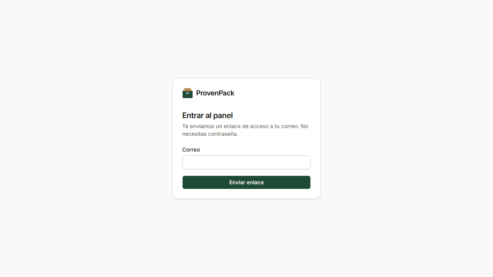

1. Entra a `/admin`, escribe tu correo y pulsa **Enviar enlace**.
2. Abre el enlace que te llega. Sirve una sola vez y vence en 60 minutos.
3. No hay contraseña. Si no llega, revisa spam o pide a admin que confirme tu cuenta en **Usuarios**.

| Rol | Qué puede hacer |
| --- | --- |
| **Administrador** | Todo, además de catálogo, plantillas, usuarios, configuración, archivos y auditoría. |
| **Ventas** | Bandeja, solicitudes, arte (si está asignado), RFQ, cotizaciones, pedidos y reportes. |
| **Operaciones y QA** | Lo mismo que Ventas. Normalmente lleva hitos, QA y pagos del pedido. |
| **Solo lectura** | Ve todo, sin cambiar nada. |

Los archivos de arte de una solicitud solo los abren la persona asignada y admin.

## 2. Rutina diaria

1. **Bandeja:** atiende primero lo que tiene el SLA vencido y lo rojo.
2. **Solicitudes nuevas:** tómalas ("Tomarla yo") y pásalas a **En revisión**.
3. **Arte:** revisa el checklist, sube el proof y, cuando el cliente lo apruebe, libéralo a fábrica.
4. **Fábrica:** genera y envía el RFQ, y registra la respuesta cuando llegue.
5. **Cotizaciones:** prepara y emite. Revisa las que vencen pronto.
6. **Pedidos:** confirma comprobantes, registra hitos con fotos y atiende los atrasados.
7. **WhatsApp:** en cada solicitud, envía los avisos pendientes con **Abrir WhatsApp** y márcalos como enviados.

## 3. Bandeja de solicitudes

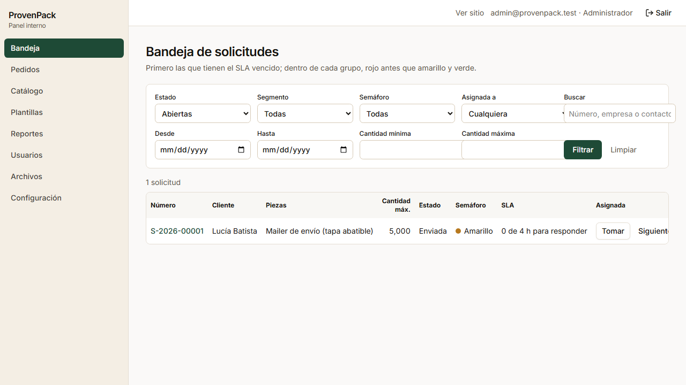

- **Orden:** primero las que tienen el SLA vencido y, dentro de cada grupo, rojo antes que amarillo y verde.
- **SLA, en horas hábiles** (lunes a viernes, 08:00–17:00, hora de Panamá):
  - 4 h para la primera respuesta (pasar a En revisión);
  - 24 h para cotizar, contadas desde que entra En revisión.
  - Si vence, el equipo recibe un correo.
- **Semáforo** (qué tan completa llegó la solicitud):
  - **Rojo:** falta el tipo, la cantidad, o el arte cuando el cliente dijo tenerlo y no lo subió.
  - **Amarillo:** faltan datos no críticos (peso, medidas del producto, referencias), o el cliente aún no tiene arte o pidió diseño.
  - **Verde:** lista para fábrica.
- **Filtros:** estado, segmento, semáforo, persona asignada, fechas, cantidades y búsqueda por número, empresa o contacto.
- **Asignar:** **Tomar** (a ti) o **Siguiente en turno** (reparte entre el equipo por orden).

## 4. Detalle de la solicitud

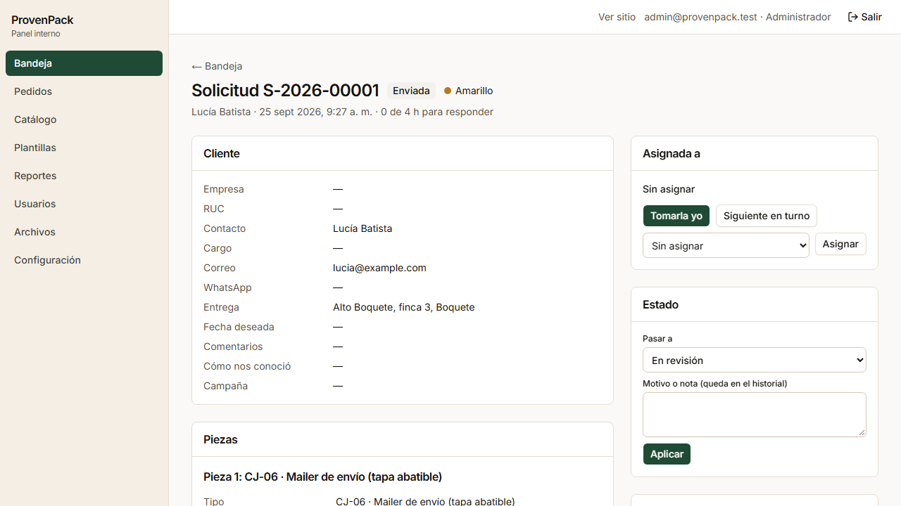

- **Cliente y Piezas:** datos de contacto y la ficha técnica de cada pieza, con sus referencias (fotos, enlaces y muestras de la galería).
- **Asignada a:** tomarla, pasarla a otra persona o al siguiente en turno.
- **Estado:** elige **Pasar a**, escribe un motivo si hace falta (queda en el historial) y pulsa **Aplicar**. Solo aparecen los pasos válidos. **Rechazada** exige elegir el motivo de pérdida.
- **Pedir datos faltantes:**
  - La lista se arma con lo que marca el semáforo; revísala y ajústala antes de enviar.
  - El cliente la recibe por correo y WhatsApp, y la solicitud pasa a **Datos pendientes**.
  - Cuando el cliente responde desde su enlace, su respuesta queda en el historial y te llega un aviso. Revísala y pasa la solicitud a **En revisión**.
- **Notas y contactos:** registra llamadas, WhatsApp o visitas, para que quien tome la solicitud después tenga el contexto.
- **Notificaciones:**
  - Cada aviso que salió o que falta enviar.
  - Los correos salen solos.
  - Los WhatsApp se envían a mano: **Abrir WhatsApp** abre el chat con el texto listo, y después se pulsa **Marcar enviado**.
- **Historial:** cada cambio de estado, con quién, cuándo y por qué.

## 5. Arte y proof

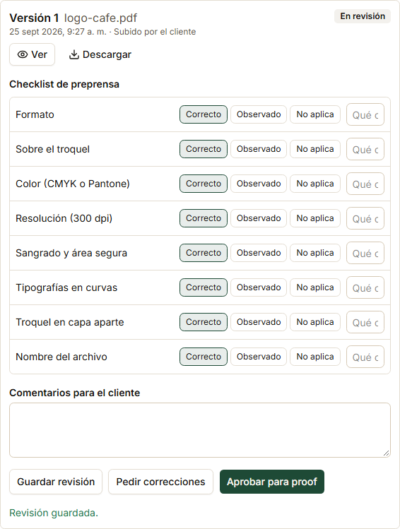

1. **Pasar a revisión**, y revisa cada punto del checklist: formato, troquel, color, resolución, sangrado, tipografías en curvas, troquel en capa aparte y nombre del archivo.
2. Si algo falla, márcalo como **Observado**, con una nota y comentarios para el cliente. El cliente ve las observaciones y sube una versión nueva.
3. Si todo está bien: **Aprobar para proof**. Solo se puede con todos los puntos en Correcto o No aplica.
4. **Subir proof** (PDF o imagen de la prueba digital). El cliente lo ve en su enlace.
5. El cliente lo aprueba con su nombre. Queda registrado con fecha, hora e IP, y ya no se puede cambiar.

   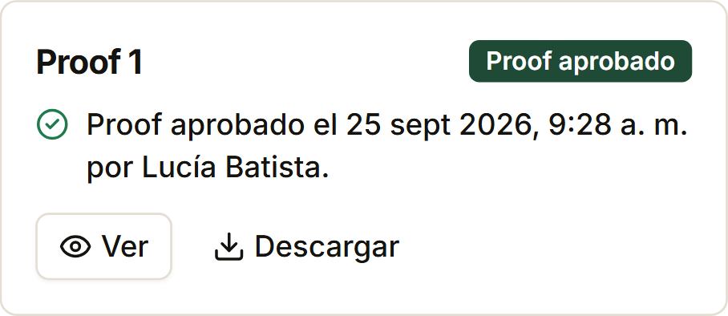

6. **Liberar a fábrica**. Ningún pedido impreso entra a producción sin proof aprobado.

## 6. RFQ a fábrica

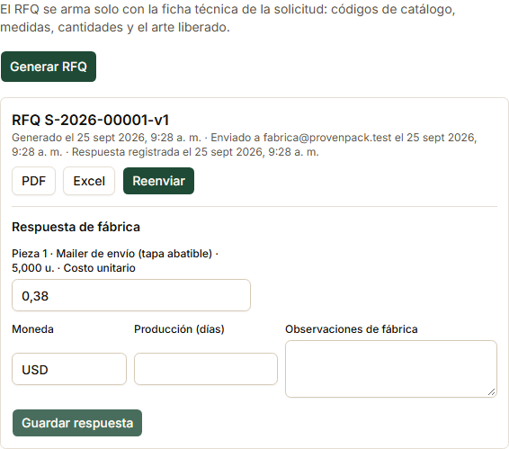

1. **Generar RFQ**: arma un PDF y un Excel con la ficha técnica, los códigos de catálogo, las cantidades y el arte liberado, sin volver a escribir nada.
2. **Enviar a fábrica**: sale por correo a la fábrica y la solicitud pasa a **RFQ enviado**. Si el servidor no tiene el correo de la fábrica configurado, descarga el PDF y el Excel y envíalos a mano.
3. Cuando la fábrica responda, completa **Respuesta de fábrica**: costo unitario por cantidad, moneda, días de producción y observaciones. Pulsa **Guardar respuesta**.

## 7. Cotización

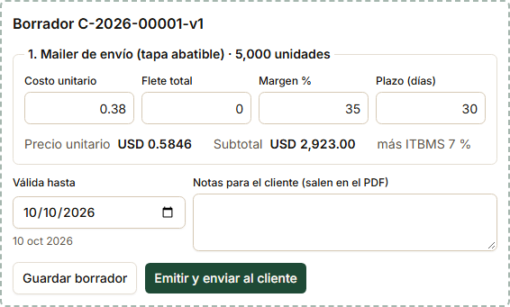

1. **Preparar cotización**: toma los costos de la respuesta de fábrica.
2. En cada línea (pieza × cantidad), completa **Flete total**, **Margen %** (por defecto el de Configuración) y **Plazo (días)**.
   - El precio se calcula así: (costo + flete por unidad) ÷ (1 − margen).
   - Todo esto es interno: el cliente nunca ve costos ni márgenes.
3. Revisa **Válida hasta** y las **Notas para el cliente**, que salen en el PDF.
4. **Emitir y enviar al cliente**: se genera el PDF con precios, vigencia, condiciones 50/50 y plazo, y el cliente recibe el aviso.

**Qué pasa después:**
- **En el portal del cliente** no aparece ningún precio: los precios están solo en el PDF que descarga. Ahí elige una cantidad por pieza y pulsa **Aceptar cotización**.

  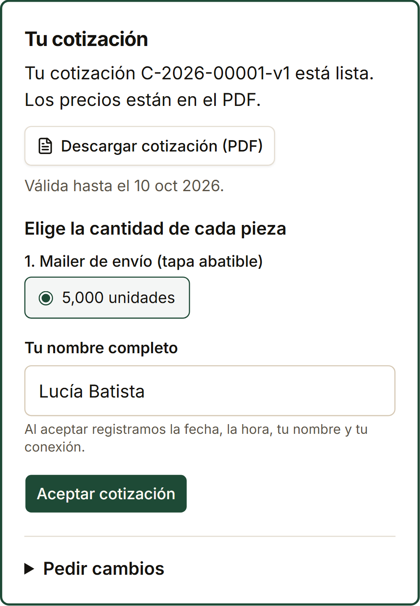

- **Si el cliente pide cambios**, queda en el historial y te avisa. **Nueva versión** crea la v2, y la v1 queda reemplazada.
- **Vencimiento:** si la vigencia pasa sin respuesta, la solicitud queda **Vencida**. El cliente recibe recordatorios 3 días y 1 día antes.

## 8. Pedido

Al aceptar, el pedido se crea solo. En la solicitud aparece el botón **Pedido P-…** y en el menú, **Pedidos**.

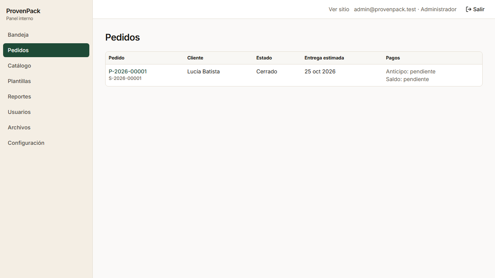

### Pagos

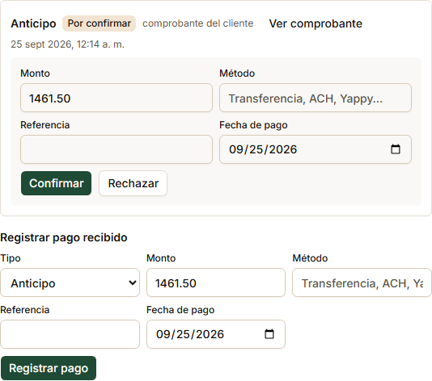

- Si el cliente sube un comprobante desde su enlace, aparece **Por confirmar**.
  1. Abre **Ver comprobante** y revisa el monto, el método y la referencia.
  2. Pulsa **Confirmar**, o **Rechazar** si no corresponde.
- Si el pago llegó por otro medio, usa **Registrar pago recibido** (anticipo o saldo).
- Al confirmar el anticipo:
  - el pedido pasa a **Anticipo recibido**;
  - el cliente recibe la confirmación;
  - se calcula la **entrega estimada**: el plazo corre desde lo último entre el anticipo y el proof aprobado.
- **Estado de pagos (PDF):** el documento con todos los montos y los pagos confirmados. El cliente también ve en su enlace el total, el anticipo, el saldo y el estado de cada pago.

### Hitos

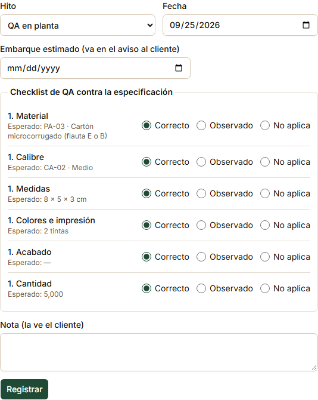

En **Registrar hito** solo aparece el siguiente paso válido.

1. **Producción iniciada:** exige el anticipo y el proof aprobado. El cliente recibe un WhatsApp.
2. **QA en planta:**
   - Marca cada punto del checklist contra la ficha aprobada: material, calibre, medidas, colores e impresión, acabado y cantidad. Usa **Observado** con comentario si algo difiere.
   - Si sabes el **Embarque estimado**, complétalo: sale en el aviso al cliente.
3. **Fotos, video o PDF:** en cada hito, **Subir fotos, video o PDF** (hasta 30 por hito). El cliente las ve en su enlace al instante.
4. **Embarcado:** transporte, guía de rastreo y llegada estimada (ETA).
5. **Entregado:** el cliente recibe el aviso con el saldo.
   - Sube como evidencia la guía firmada o el acta de entrega.
   - Si el saldo no está confirmado, a los 2 y 5 días sale un recordatorio.
6. **Pedido cerrado:** exige el saldo confirmado. A los 7 días, el cliente recibe la encuesta de satisfacción.

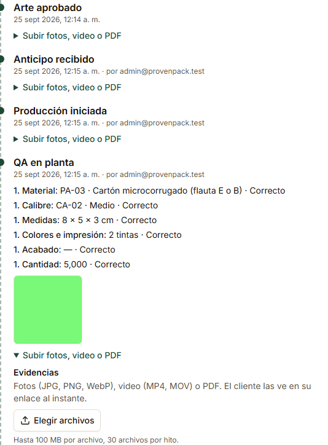

**Atrasado:** aparece en rojo cuando la ETA (o la entrega estimada, si no hay ETA) ya pasó y el pedido no se entregó.

### Qué ve el cliente

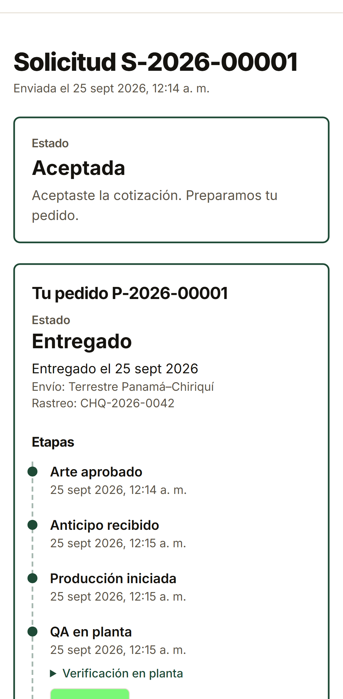

- Estado y entrega estimada.
- Cada etapa, con fotos y el resultado de QA.
- Total, anticipo y saldo del pedido, "más ITBMS 7 %", y el estado de cada pago.
- Cómo pagar (texto de Configuración) y un botón para subir el comprobante.
- Cotización, ficha técnica y estado de pagos en PDF.
- **Pedir de nuevo:** abre el cotizador con las mismas piezas.
- La encuesta, al entregar o cerrar el pedido.

## 9. Reportes

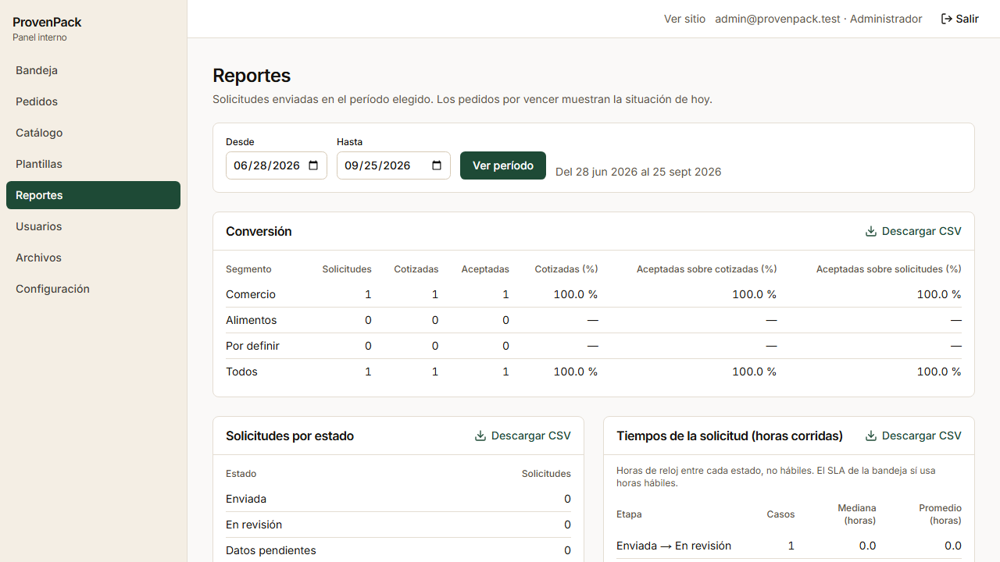

- Elige el período (por fecha de envío de la solicitud). Cada tabla tiene **Descargar CSV**, que abre directo en Google Sheets o Excel.
- **Tablas:**
  - conversión por segmento;
  - solicitudes por estado;
  - tiempos de la solicitud (horas) y del pedido (días);
  - motivos de pérdida;
  - tipos y materiales más pedidos;
  - pedidos por vencer (próximos 14 días y atrasados);
  - solicitudes por canal. Las visitas al sitio se ven en Google Analytics.

## 10. Solo administración

- **Catálogo**:
  - tipos, tamaños, papeles, calibres, impresión, acabados, atributos y compatibilidades;
  - la galería de muestras: fotos una por una o en lote con `pnpm gallery:import` (ver `docs/lanzamiento.md`);
  - lo marcado PROVISIONAL se ve solo en el panel.

  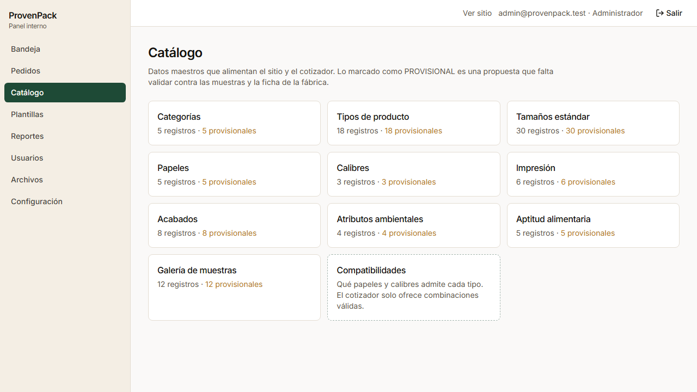

- **Plantillas:** textos de cada correo y WhatsApp, con vista previa. Solo acepta las variables que existen (por ejemplo `{nombre}` o `{numero}`).

  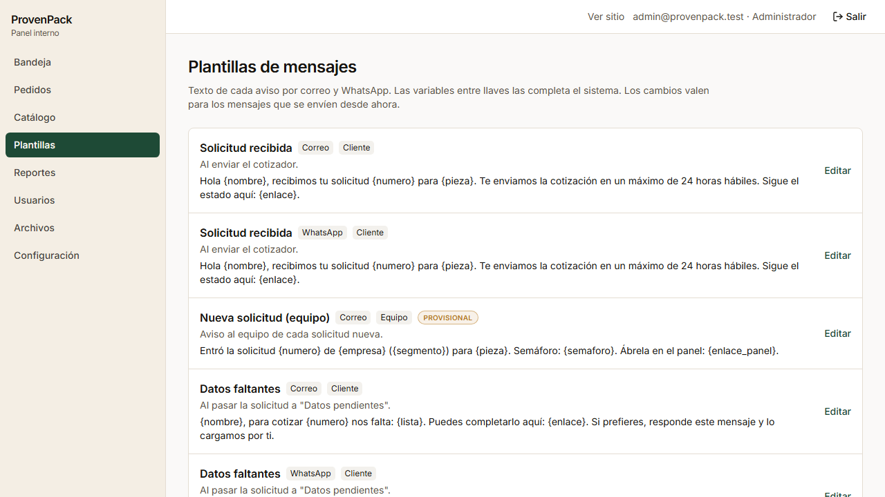

- **Usuarios:** invitar por correo, cambiar el rol y desactivar. No se puede quitar el último administrador.

  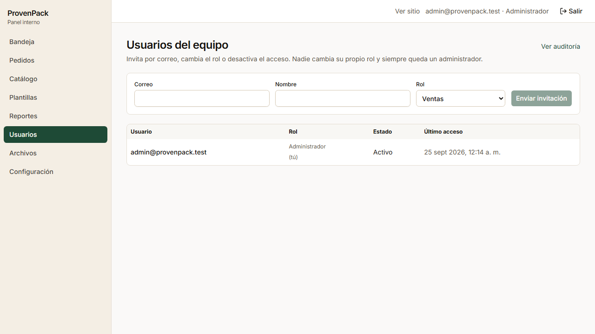

- **Configuración:**
  - margen por defecto, vigencia de la cotización, % de anticipo, plazos, SLA y horario hábil;
  - tamaño máximo de archivo y meses de retención del arte;
  - correo del equipo para avisos;
  - **Instrucciones de pago** que ve el cliente (banco, cuenta, Yappy).
  - Los valores PROVISIONAL están marcados.

  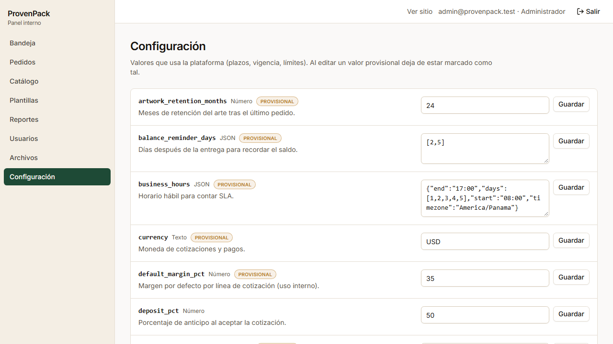

- **Archivos:** arte vencido según la retención. Se marca solo; se borra cuando admin lo confirma.

  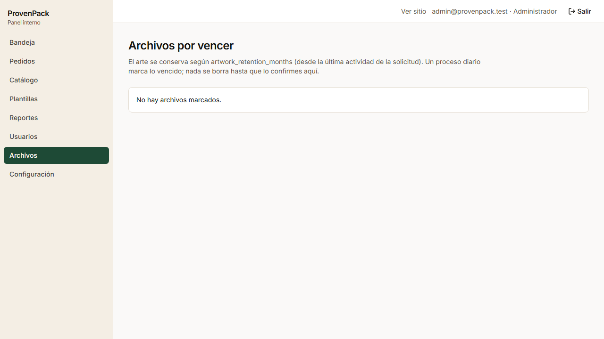

- **Auditoría:** quién cambió qué y cuándo, con el antes y el después.

## 11. Preguntas frecuentes

- **No puedo abrir el arte de una solicitud.** Solo lo abren la persona asignada y admin. Pulsa **Tomarla yo** o pide que te la asignen.
- **No me deja pasar a producción.** Falta el anticipo confirmado, o el proof aprobado de alguna pieza impresa. El aviso amarillo del pedido dice cuál.
- **El cliente dice que no ve precios.** Antes de aceptar, los precios están solo en el PDF de la cotización: pídele que lo descargue desde su enlace. Después de aceptar, su enlace muestra los montos del pedido.
- **El cliente perdió su enlace.** Está en el correo de confirmación de su solicitud. También se lo puedes reenviar desde **Notificaciones** con **Abrir WhatsApp** en cualquier aviso.
- **Un aviso de WhatsApp no salió.** Los WhatsApp no salen solos: ábrelo desde **Notificaciones** y márcalo como enviado.
- **"Demasiados intentos" o "Pediste varios enlaces seguidos".** Es un tope de seguridad. Espera 15 minutos.
